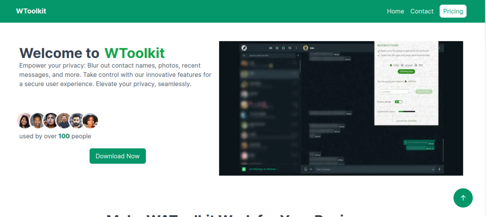
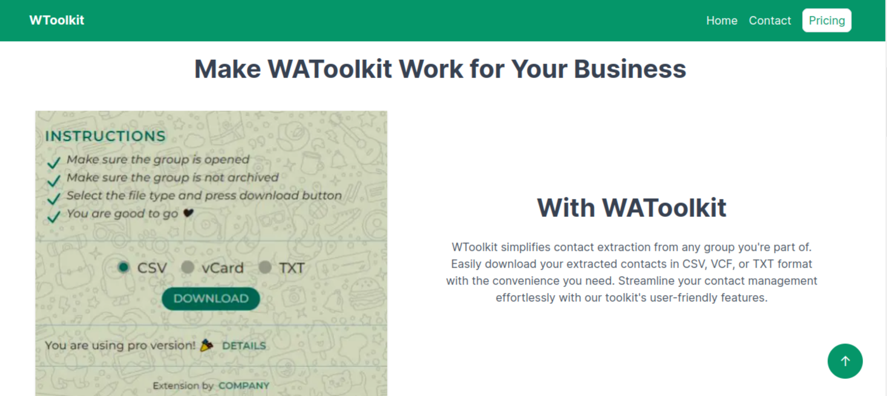
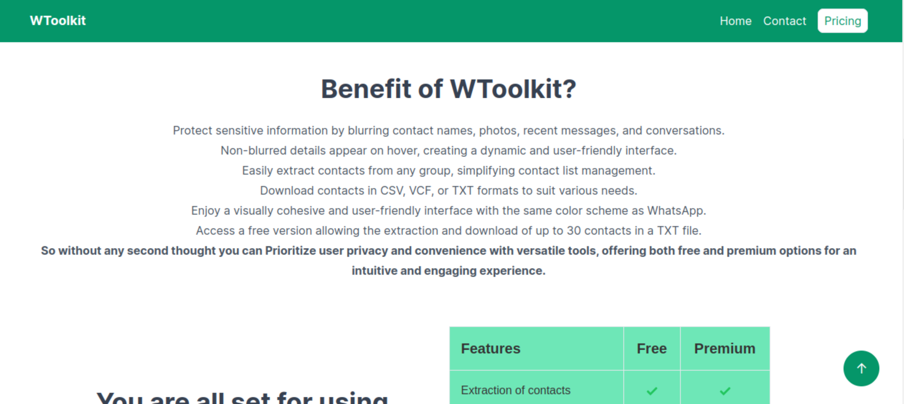
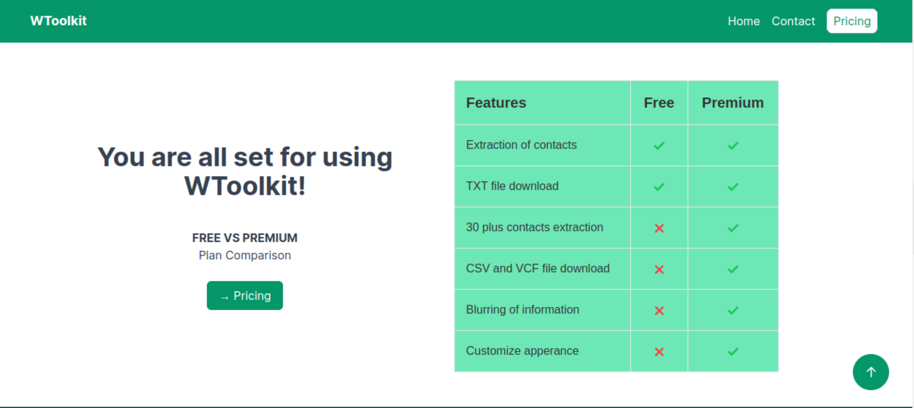
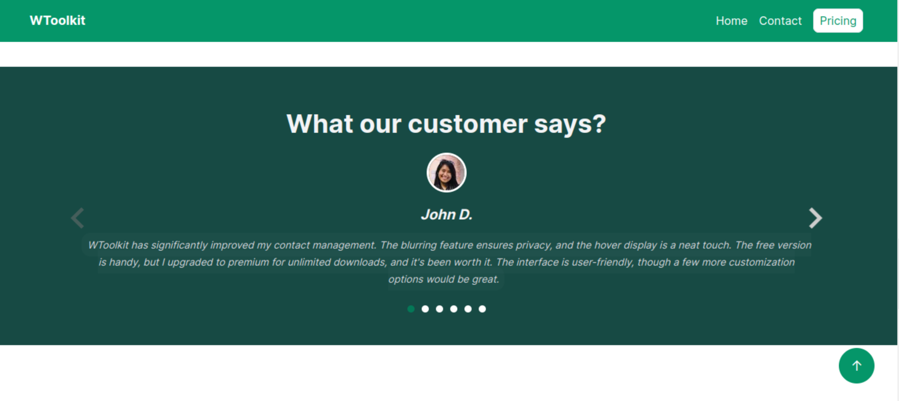
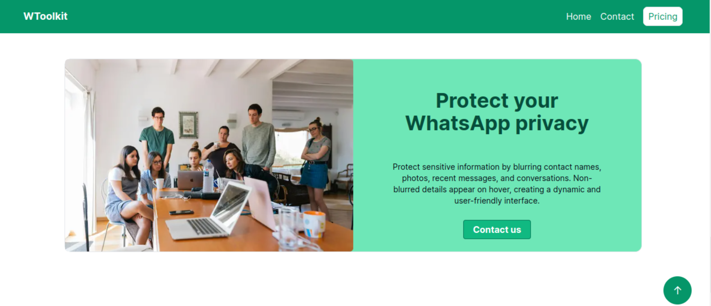
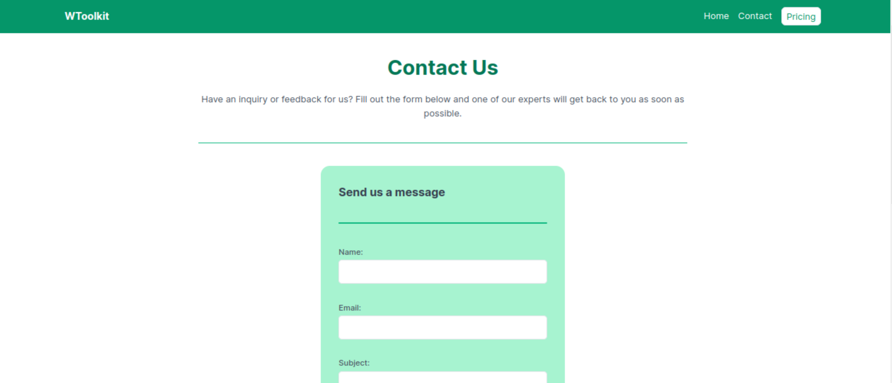
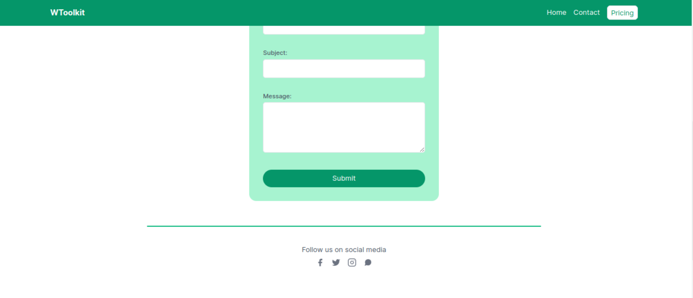
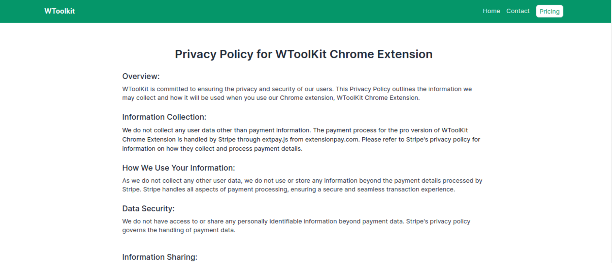

# WToolkit

This is a simple website for WToolkit extension that you can use to
Empower your privacy: Blur out contact names, photos, recent messages,
and more. Take control with our innovative features for a secure user
experience. Elevate your privacy, seamlessly. you can find the live
demo [ here ](https://whatsapp-toolkit.vercel.app/)

- [Find me on fiver ](https://www.fiverr.com/zainbinramzan/develop-web-applications-with-mern-stack-react-node-express-moongodbplugin-react/README.md)
- [Find me on linkedin](https://www.linkedin.com/in/abu-zain-html-css-javascipt-developer/)

## Tech Stack

- **Frontend:** Developed using React and Next.js.
- **State Management:** Redux Toolkit and Redux Thunk.
- **Backend:** Built with Node.js and Express.
- **Database:** MongoDB.
- **HTTP Requests:** Axios.

## Team Collaboration

This project was a collaboration between two individuals:

- Frontend-Developer:
[Abu Zain](https://www.linkedin.com/in/abu-zain-html-css-javascipt-developer/)
<!-- - ignore-pretier -->
- Backend-Developer:
  [Faizan Ashiq](https://www.linkedin.com/in/faizan-ashiq/)

##### If you want to learn Next js, React hooks, or you are looking for a project where you can learn how all the pieces are fit together then you are at right place
